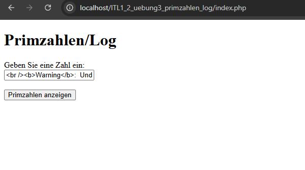
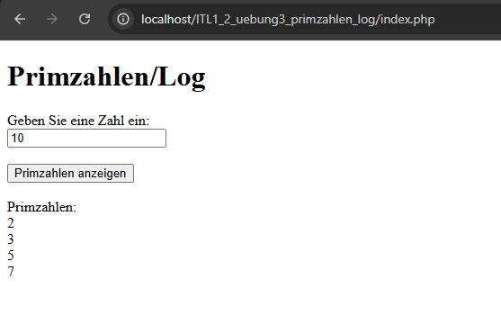
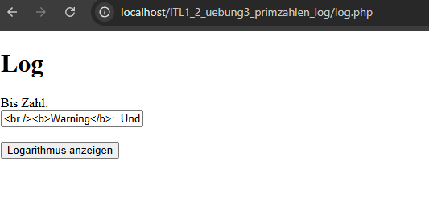
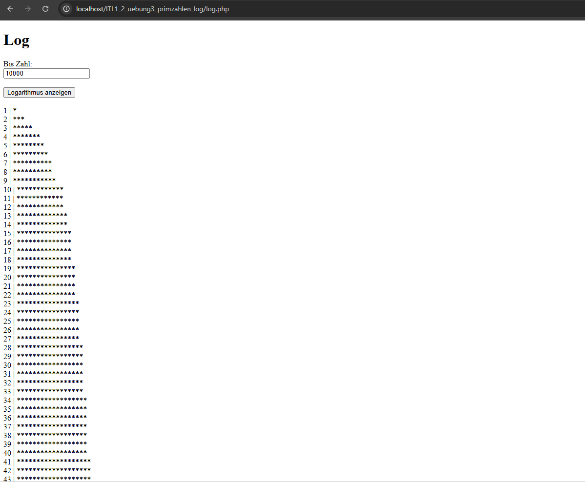

ITL1_2 - Übung 3
Primzahlen und Log
Author: Schloffer Lisa
2025/26

## Umsetzung Prim

1. Zuerst ging es mir darum erstmal wie bei Übung 2 nur ein leeres Feld zu haben.

2. Dann habe ich die Logik vom Rechner umgesetzt. Auch hier habe ich mich zu Beginn noch an die zweite Übung gehalten.

## Umsetzung Log

1. Auch hier habe ich zuerst das Eingabefeld erstellt.

2. Und dann habe ich mich um den Log gekümmert. 

